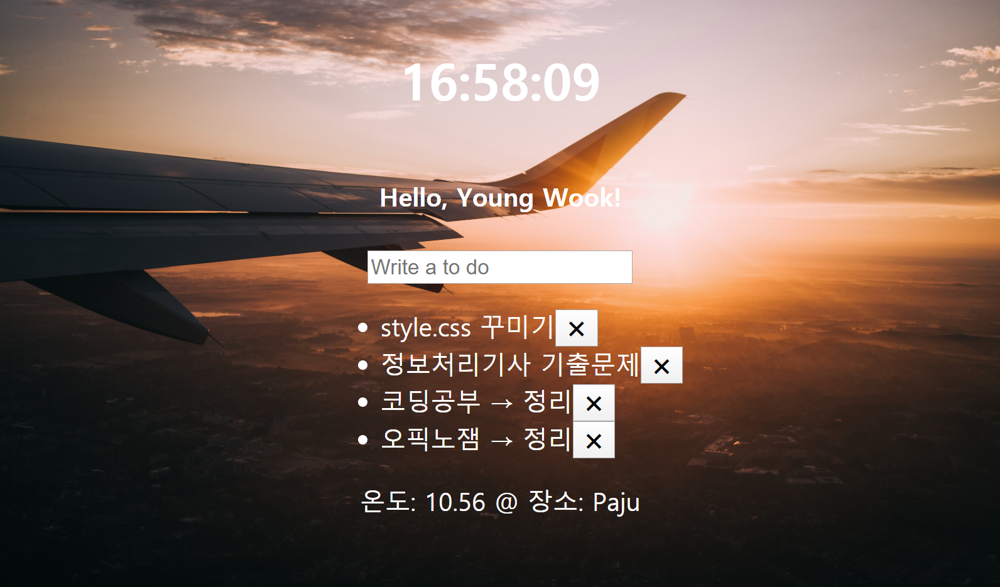

# Momentum-Clone
- Website made with Vanilla JS

## Demo Picture

## Project Description 
This is the first webpage I created. It contains many functions. Enjoy!  
제가 처음 만든 웹페이지입니다. 여러기능들은 아래의 feature를 참고해주세요.
### Feature 
- clocks (시계기능)
- greetings (환영인사)
- work-to-do (To do list, 할 일 적기)
- temperature (온도 변화 감지)
- local functions (지역 찾기)

## Customization: How to run this project
Very simple. Download the project folder and execute index.html file.  
프로젝트를 로컬컴퓨터에 다운로드 하신후 index.html 파일을 클릭하시면 실행 가능합니다. 

## What I used for this project 
- Vanilla JS
- CSS
- HTML
